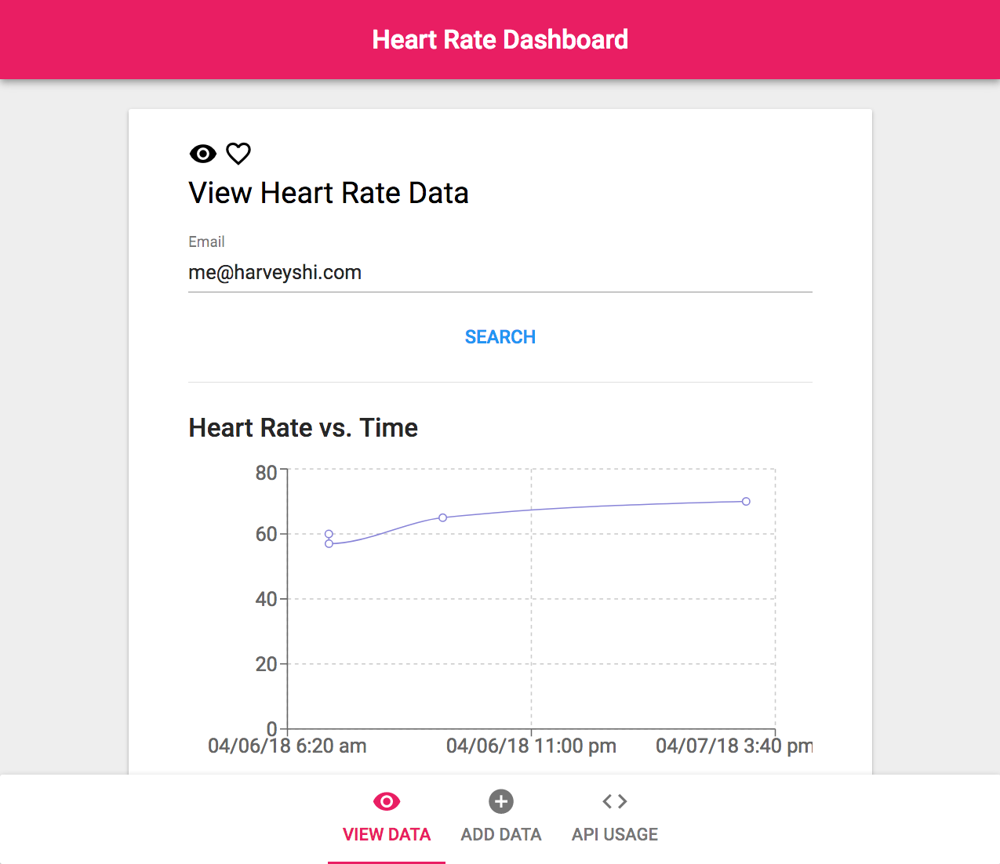
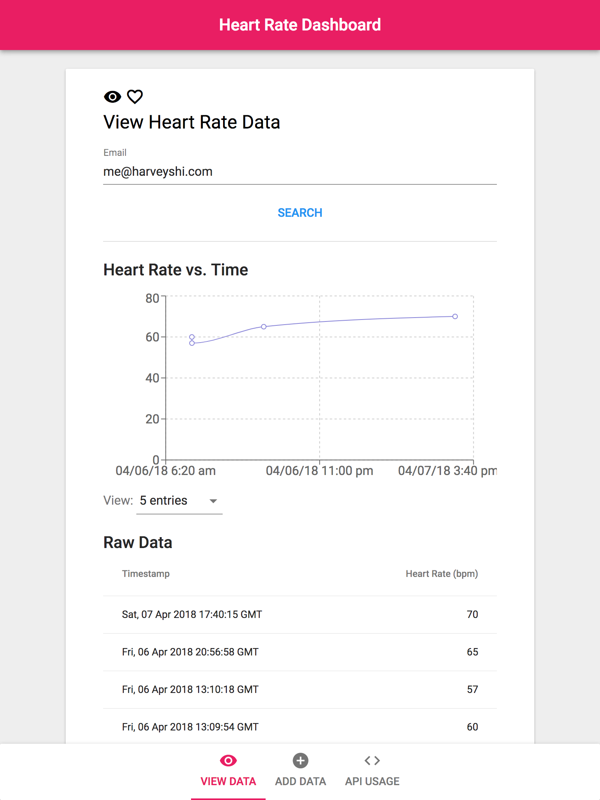
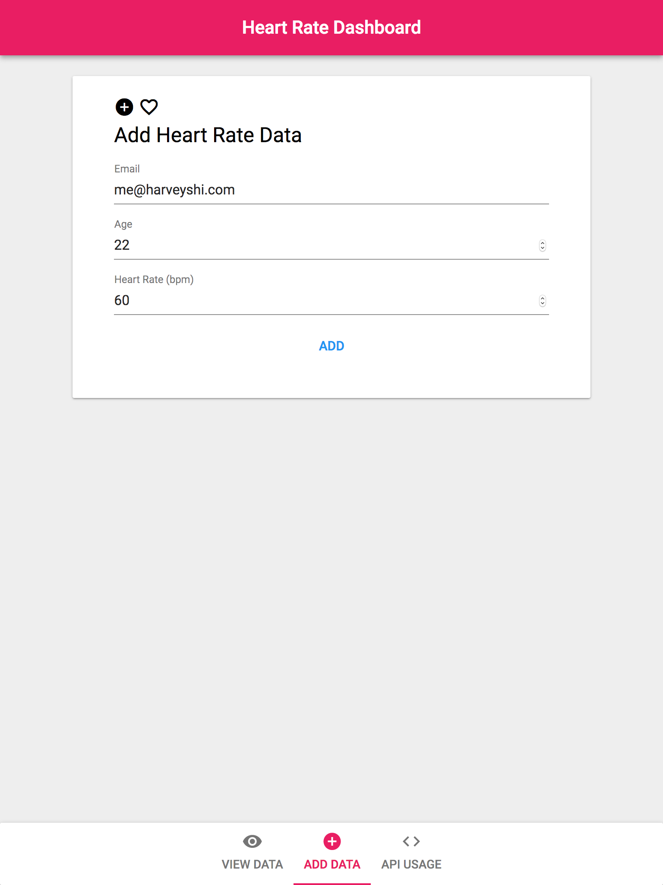
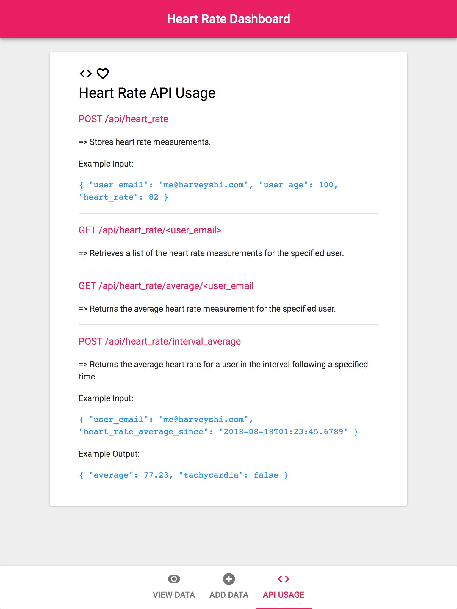

# Heart Rate Dashboard

__Developed by:__ Harvey Shi (@rvshi)

__Course:__ BME 590 Spring 2018

## Introduction

Heart Rate Dashboard is a frontend interface for interacting with my [Heart Rate Database](https://github.com/rvshi/heart_rate_databases_introduction).
- Allows users to search and view heart rate entries.
    - Both a graph and table of the data is available.
- Has support for adding new heart rate entries.
- Also presents the API usage with examples.

## Under the hood
- A completely static website built with [React](https://reactjs.org/) and [Material-UI](https://material-ui-next.com/).
- Uses [Axios](https://github.com/axios/axios) for making requests.
- Displays heart rate data using [Recharts](https://github.com/recharts/recharts).
- Uses [react-gh-pages](https://github.com/gitname/react-gh-pages) for deployment.

## Usage
- To test the site locally, run `$ npm run start`
- To build the site for production, run `$ npm run build`. The production files will be in the `build/` directory
## Screenshots
From left to right, database search, adding entries, and API usage.

  
